# PROMPTS

List of prompts that were used to generate the images.

| Filename | Prompt |
| --- | --- |
| 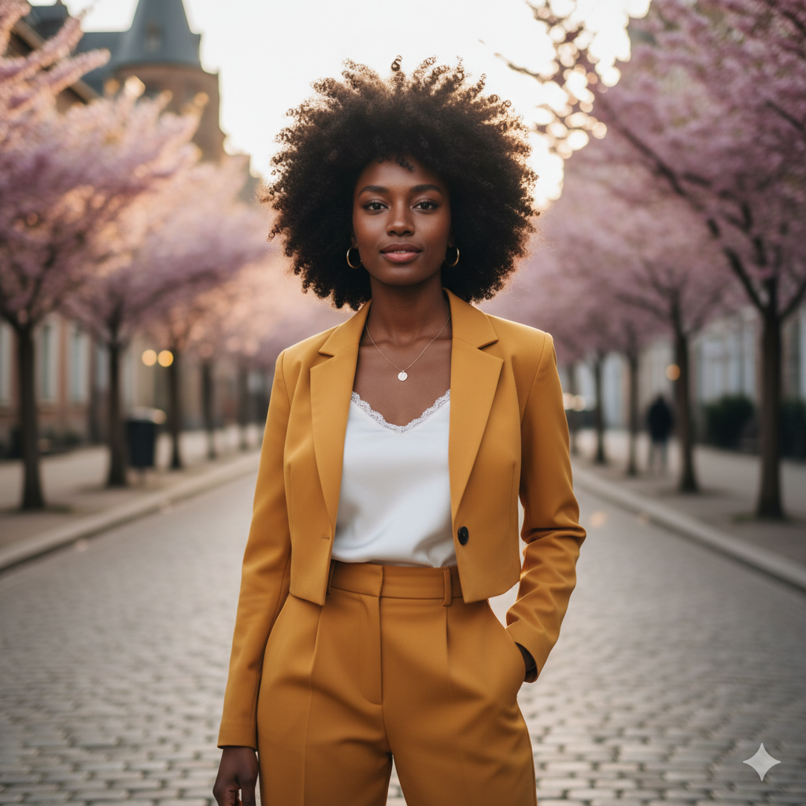 | a medium shot of a black female model. |
|  | a long shot of a caucasian blonde female model. |
| 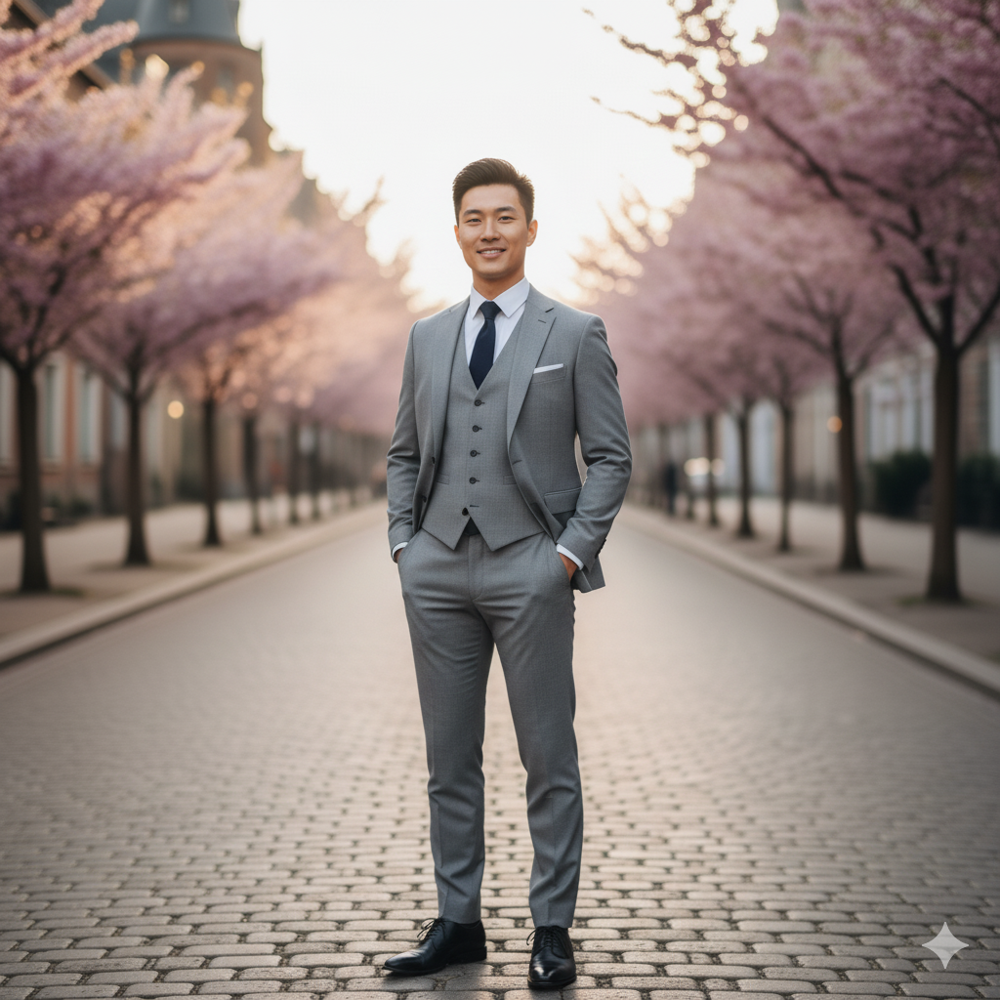 | an extremely long shot of a asian male model.|
|  | Create a 3D isometric digital sculpture of a bronze sculpted relief of a ballerina, crafted with intricate detail and refined elegance. The ballerina is captured mid-dance, her posture graceful and balanced — one arm extended outward, the other raised gently upward, forming a fluid curve that expresses motion and poise.  Her skirt fans out dramatically in a circular motion, resembling flower petals or a swirling wave, with deeply carved folds and ripples that suggest movement and texture. The bodice is form-fitting, accentuating her slender frame and perfect ballet posture.  The background relief subtly recedes behind her, framing the dancer like a stage and creating depth and contrast within the sculpture.  The entire piece is made of bronze, featuring a rich dark patina with warm golden highlights where light strikes the raised surfaces.  Use soft, directional studio lighting to emphasize the metallic sheen and shadow depth.  Rendered as a realistic isometric digital sculpture, with museum-quality detail, cinematic lighting, and a sense of timeless beauty, elegance, and strength — a tribute to ballet frozen in motion. |
| 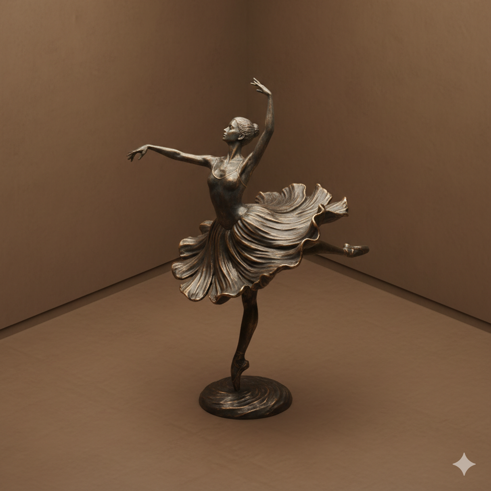 | A 3D isometric digital sculpture of a bronze ballerina, displayed as a free-standing figure in the center of a minimalist room.  The ballerina is mid-dance, graceful and balanced, with one arm extended outward and the other raised gently upward, forming a fluid, elegant curve that conveys motion and poise.  Her skirt flares outward like flower petals or a swirling wave, sculpted with deep folds and ripples that show movement and texture. The bodice is form-fitting, emphasizing her slender frame and perfect ballet posture.  The entire sculpture is bronze, with a dark patina and warm golden highlights on raised surfaces.  The background is a soft, warm-toned minimalist space in bronze or muted brown hues, keeping focus on the sculpture while maintaining tonal harmony.  Use soft, directional studio lighting to emphasize metallic reflections, subtle shadows, and depth.  Rendered in a realistic 3D digital art style with museum-quality detail, cinematic lighting, and a sense of timeless elegance, strength, and motion. |
|  | Create a 3D isometric digital sculpture of a bronze ballerina, displayed as a free-standing figure in the center of a minimalist room. The ballerina is sculpted in exquisite detail, captured mid-dance with a graceful and balanced posture — one arm extended outward, the other raised gently upward, forming a fluid, elegant curve that conveys motion and poise. Her skirt flows outward in a circular motion, like flower petals or a swirling wave, with deeply carved folds and ripples that create a sense of movement and lifelike texture. The bodice is form-fitting, highlighting her slender frame and perfect ballet posture. The sculpture is made of bronze, with a rich dark patina and warm golden highlights where light catches its surface. Place the figure in a softly lit 3D space with a warm, neutral background color similar to bronze tones, maintaining visual harmony with the sculpture. Use soft, directional studio lighting to accentuate the metallic sheen, subtle shadows, and contours of the dancer’s form. Rendered as a realistic isometric digital sculpture, with museum-quality detail, cinematic lighting, and a sense of timeless beauty and elegance — a tribute to ballet suspended in motion. |
|  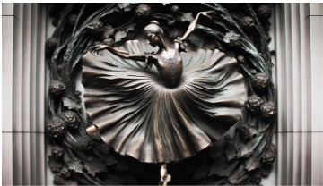 | Make some adjustments to image you generated to be the same as the attached image focusing on the ballerina posture and her skirt. The ballerina is captured mid-dance, her posture graceful and poised. She extends one arm outward and the other gently upward, creating a fluid curve that emphasizes motion and balance. Her skirt fans out dramatically in a circular motion, resembling the petals of a flower or the swirl of a wave — the sculpting of the fabric is detailed, with deep folds and ripples that give it lifelike texture and movement. The bodice of her outfit is form-fitting, highlighting her slender frame and perfect posture. |
|   | The main object in the attached image is the ballerina. Remove the background and make the ballerina a 3D isometric digital sculpture of a bronze ballerina, displayed as a free-standing figure in the center of a minimalist room. |
|  | Generate an image that shows Minimalist conceptual illustration of evolving understanding of artificial intelligence — soft gradient lines forming a neural network pattern, calm neutral background, modern and clean aesthetic. |
|  | A futuristic yet warm scene illustrating the interaction between humans and artificial intelligence in daily life. A person sits at a desk or workspace, interacting with a holographic or semi-transparent AI interface, showing flowing patterns of data and neural network-like visualizations around them. Soft natural light filters into the room, symbolizing human warmth and curiosity. The environment blends technology with everyday life: books, plants, and coffee cups coexist with holograms, digital screens, and glowing AI elements. The style is modern, clean, and slightly conceptual, balancing realism and artistic abstraction. Emphasize harmony between human presence and intelligent technology, with a sense of reflection, creativity, and curiosity. |
| 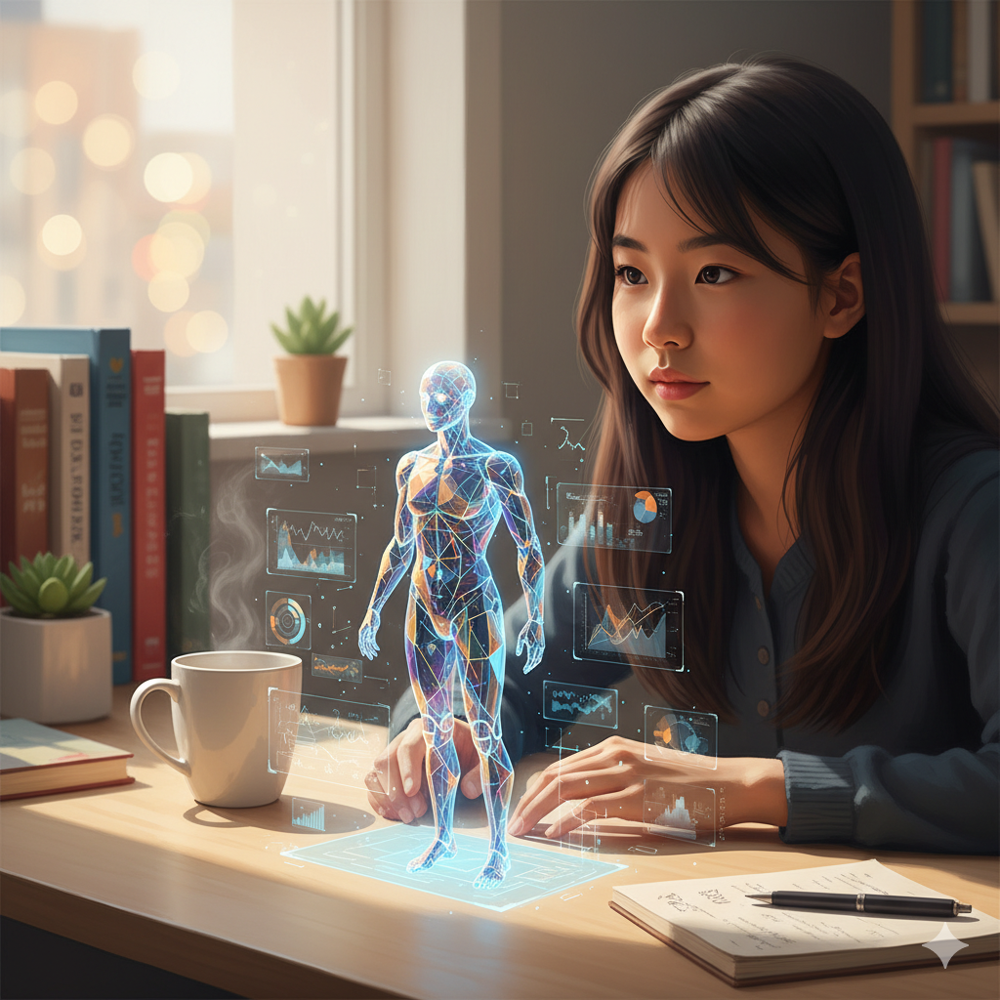 | [Cinematic close-up] of an Asian teenager (soft, curious expression) seated at a minimalist, light-wood desk in her home office. The lighting is soft, diffused natural light (high-key look) coming from the side. The focus is on the hands of the girl resting near a steaming coffee mug and the semi-transparent, glowing AI humanoid hovering just above the desk surface. The AI is not human-shaped but a complex, beautiful, gently rotating geometric light form that projects subtle, informative holographic infographics onto the desk. ENVIRONMENT: The backdrop shows intentional clutter: well-read books, a small succulent, and a personalized notepad. STYLE: Concept Art/Digital Painting with extreme photorealism and a shallow depth of field (bokeh effect) to emphasize the contrast between the warm, textured foreground and the sharp, glowing technological elements. Focus on the theme of serene co-existence and focused intellectual curiosity. |
| 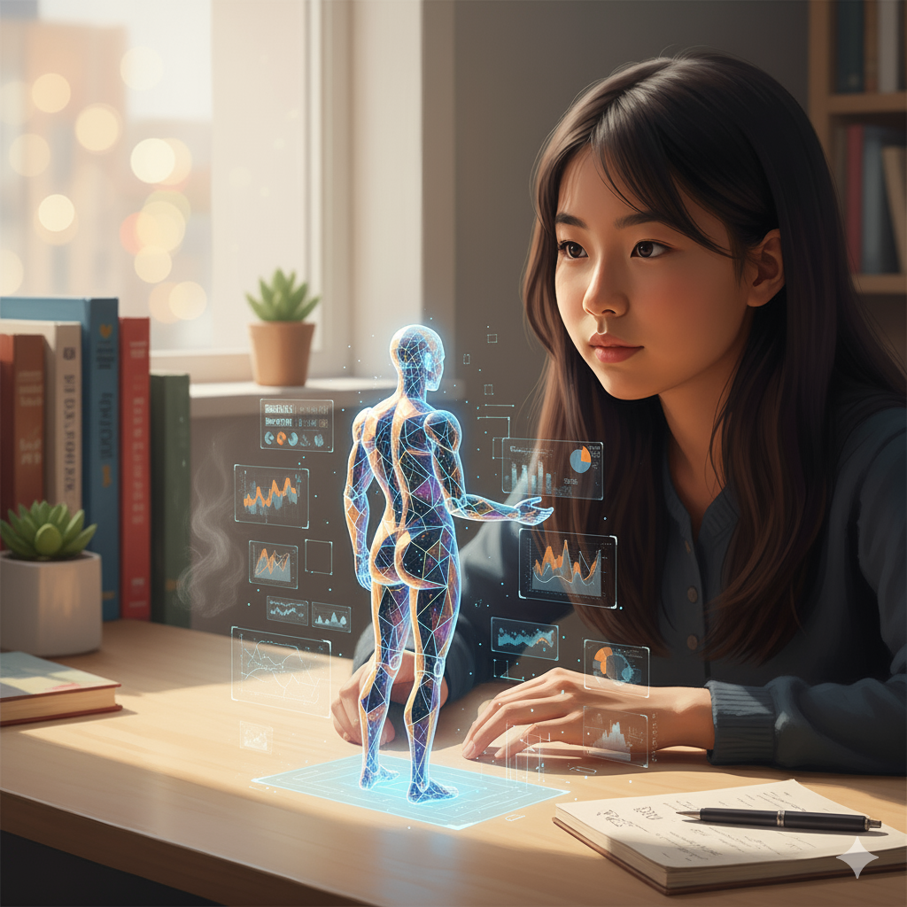 | Make the AI humanoid faces the teenager with the body posture of having conversation with the teenager. Remove the coffee cup. |
| 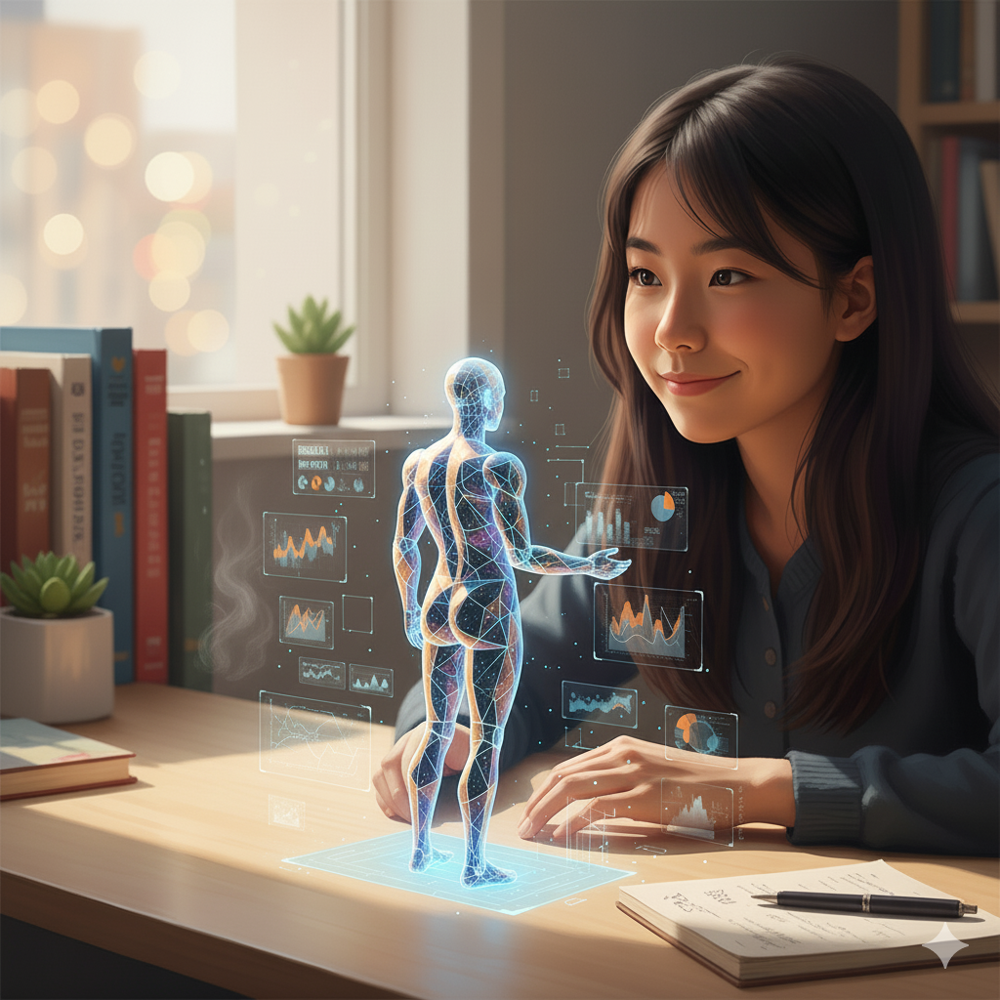 | Make the teenager look at and pay attention to the AI humanoid and the teenager facial expression is relax, casual and curious. |
| 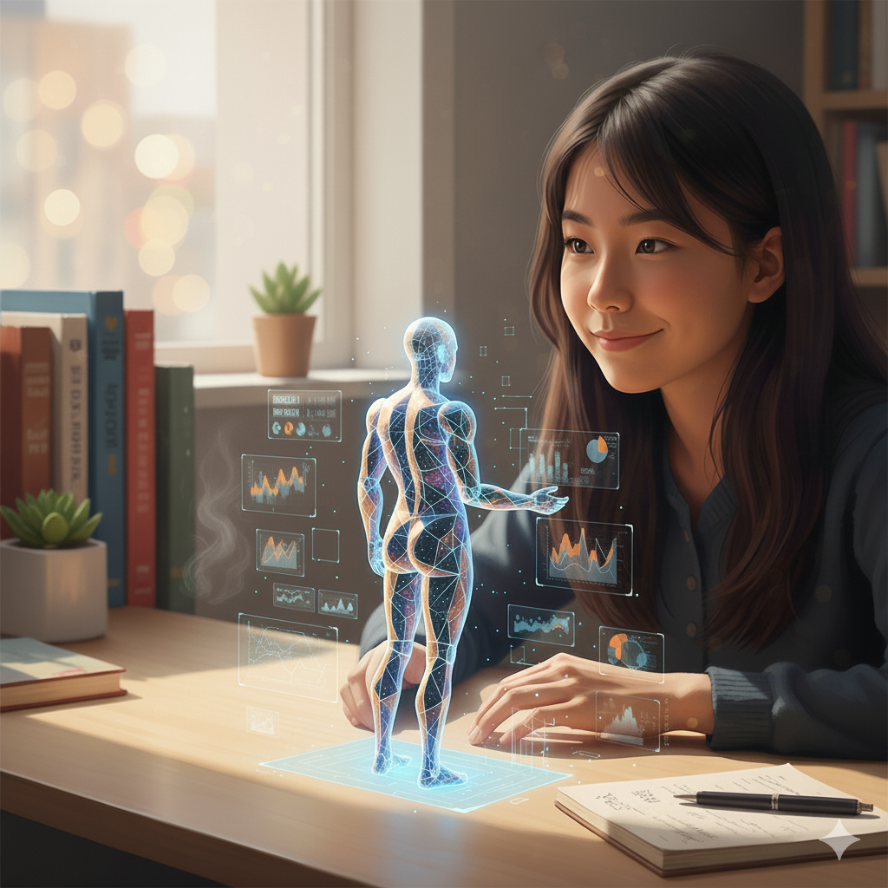 | The teenage girl need to make eye contact with the AI humanoid. |
| 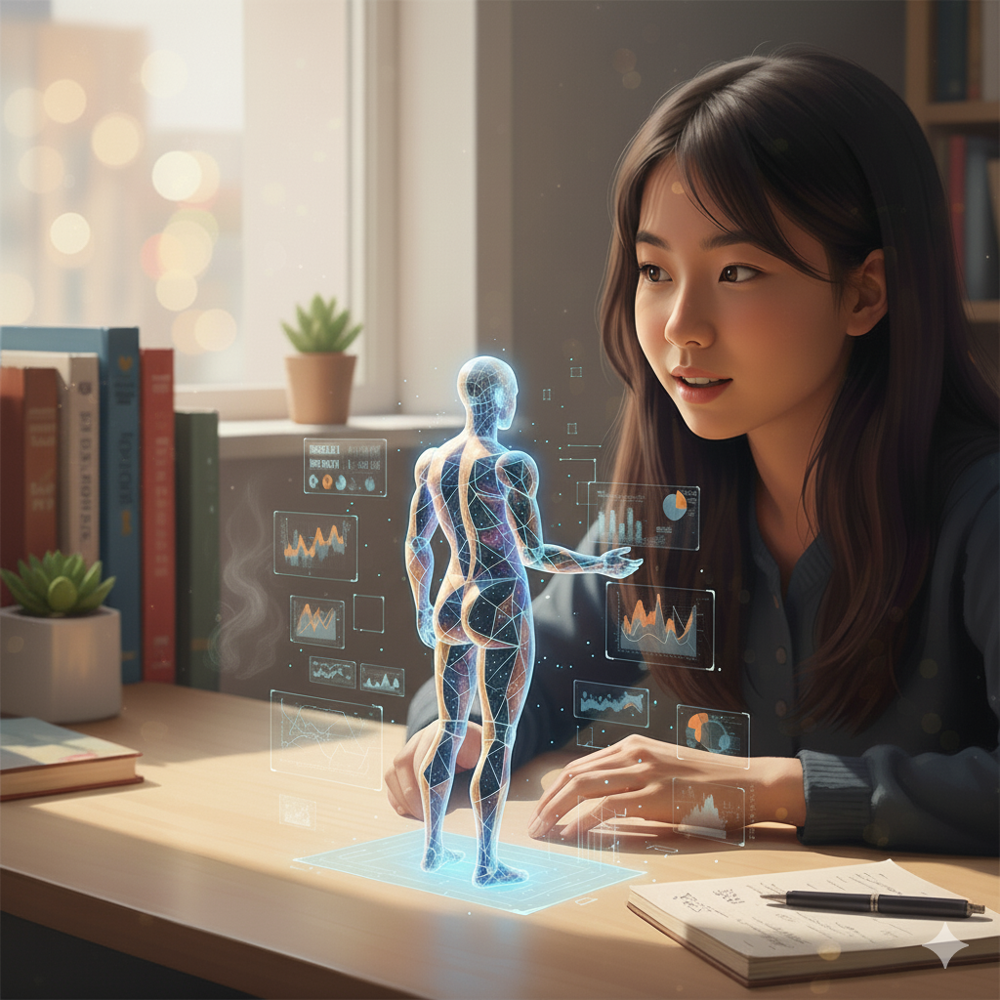 | Make the teenage girl looking down a bit to have a direct eye-to-eye contact with the AI humanoid in a more facial expression. |
| 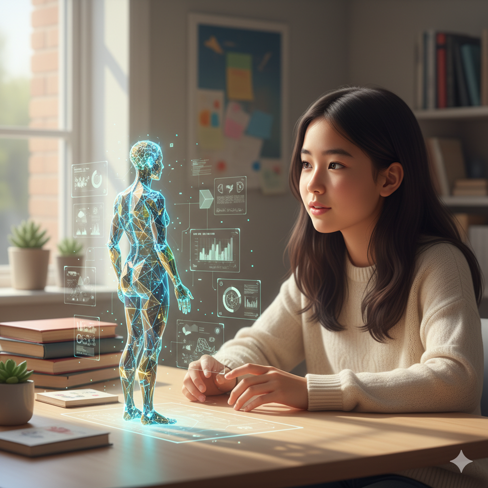 | [Cinematic close-up] of an Asian teenager (soft, curious expression) seated at a minimalist, light-wood desk in her home office. The lighting is soft, diffused natural light creating a high-key look, filtering strongly from the side. The composition emphasizes the girl's hands resting near the AI. The AI is a complex, gently rotating geometric light structure that assumes a human-like posture, facing the teenager in conversation. This glowing entity hovers just above the desk surface, projecting subtle, informative holographic infographics onto the wood. The teenager maintains direct eye-to-eye contact with the AI; her facial expression is relaxed, casual, yet intensely engaged. ENVIRONMENT: The backdrop features intentional clutter of human warmth: well-read books, a small succulent, and a personalized notepad. STYLE: Concept Art/Digital Painting with extreme photorealism and a shallow depth of field (bokeh effect). The focus must be on the contrast between the warm, textured human foreground and the sharp, glowing technological elements, emphasizing serene co-existence and focused intellectual curiosity.|
|  | Create a cinematic close-up portrait (1:1 composition) of an **Asian teenage girl** with a **soft, curious expression**, seated at a **minimalist light-wood desk** in her **home office**. The scene glows with **diffused natural light**, creating a **high-key, airy atmosphere** with light filtering gently from the side.  Centered in the frame, the **teenager** leans slightly forward, her **hands resting near a hovering AI entity — a delicate, geometric light sculpture** with a **human-like posture, gently rotating** and **radiating soft cyan and amber hues**. The AI projects **faint holographic infographics** onto the wooden surface, casting subtle reflections on her hands.  Her **eyes meet the AI’s luminous core** with **relaxed focus and intellectual engagement**, evoking quiet wonder and curiosity.  **Background (softly blurred for depth)**: neatly arranged **books**, a **small succulent**, and a **personalized notepad**, adding human warmth and authenticity.  **Style & Technical Details:**  **Concept Art / Digital Painting** with **extreme photorealism**  **Square 1:1 composition** with **balanced central framing**  **Shallow depth of field (bokeh effect)** for cinematic isolation  **Warm human textures** contrasted against **cool, glowing AI light**  **Ultra-detailed textures**, **soft atmospheric haze**, and **cinematic tone mapping**  Emphasize **harmonious human–AI coexistence**, **serene focus**, and **emotional realism** |
| 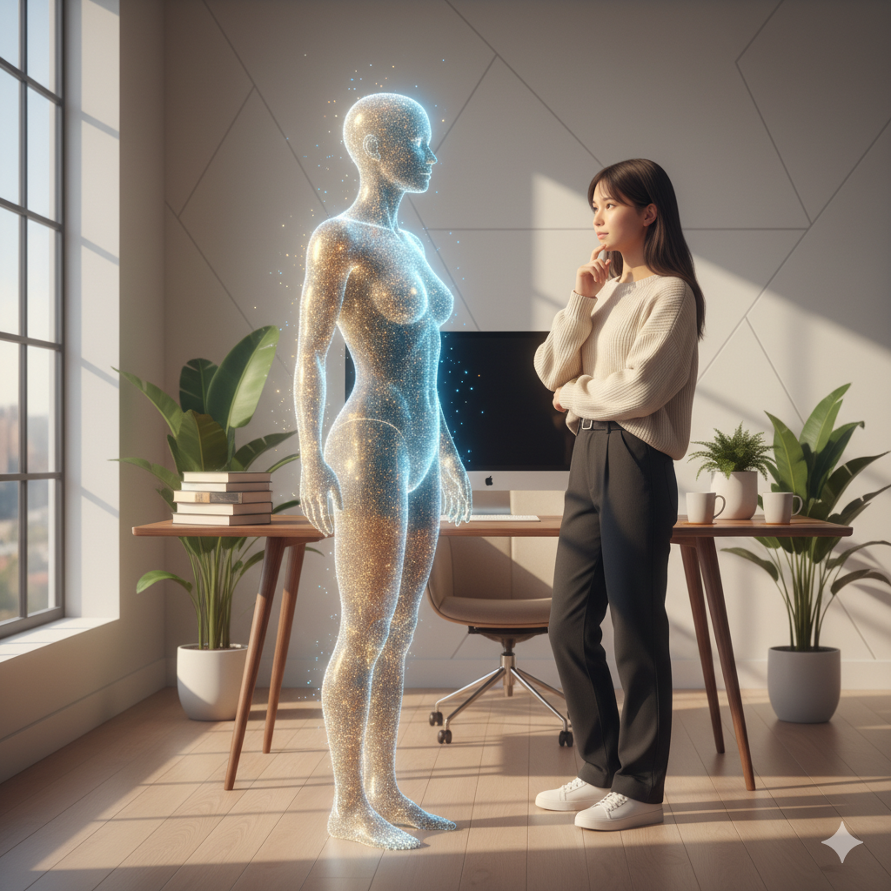 | [Medium shot], following the Rule of Thirds. A modern, sunlit home office. An Asian teenage girl (approx. 16, casual yet stylish) is standing, making a thoughtful gesture with one hand as she converses with a holographic, semi-transparent AI humanoid. LIGHTING: The scene is bathed in warm, golden hour light filtering from a window, creating long, soft shadows. This light emphasizes the human elements: hardcover books, ceramic mugs, and vibrant green houseplants. AI VISUALS: The AI is composed of shimmering, ethereal blue and gold light, projected slightly off-center. Its glow is soft, reflecting gently on the girl's face and the surrounding furniture, symbolizing intelligent presence without being intrusive. MOOD/STYLE: The overall style is neo-futurism—modern, clean, and highly conceptual, blending hyper-realism with artistic abstraction. The image must emphasize harmony, deep reflection, and creative curiosity between human warmth and seamless intelligent technology. |
| 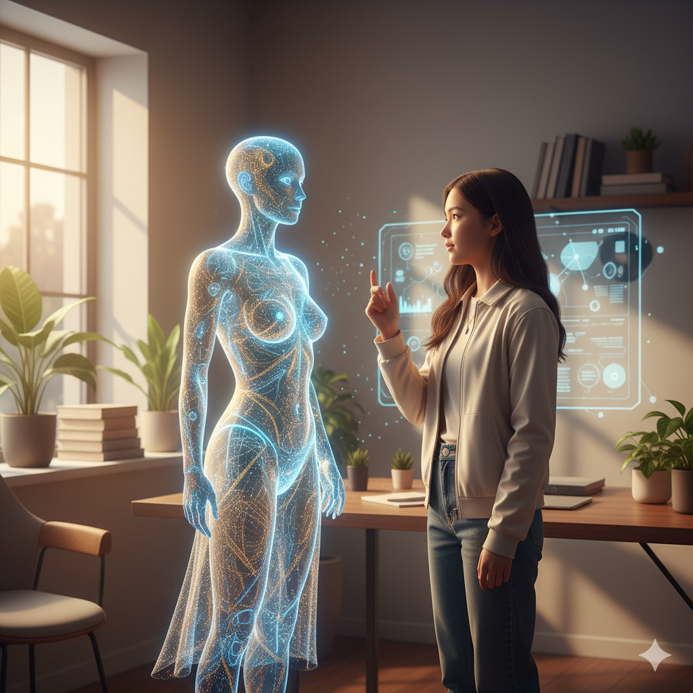 | Create a [Medium shot], Rule of Thirds composition. A modern, sunlit home office. An Asian teenage girl (approx. 16, casually stylish) stands, one hand thoughtfully gestured, in conversation with a holographic, semi-transparent AI humanoid. The AI humanoid is precisely the same height as the girl and is visibly 'dressed' or composed of light patterns that avoid any impression of nudity.  LIGHTING: The scene is imbued with warm, golden hour sunlight streaming from a window, casting long, soft shadows. This lighting accentuates the organic, human elements: hardcover books and vibrant green houseplants. Instead of a traditional computer monitor, an informative holographic infographic is subtly integrated into the scene, perhaps projected onto a surface or floating.  AI VISUALS: The AI is rendered as shimmering, ethereal blue and gold light, projected slightly off-center to create dynamic balance. Its soft glow gently illuminates the girl's face and nearby surfaces, symbolizing an intelligent, non-intrusive presence. The image features a shallow depth of field (bokeh effect) to highlight the interaction.  MOOD/STYLE: The aesthetic is neo-futurism—modern, clean, and highly conceptual, seamlessly blending hyper-realism with artistic abstraction. The core emphasis is on harmony, deep reflection, and creative curiosity between human warmth and advanced intelligent technology. |
| 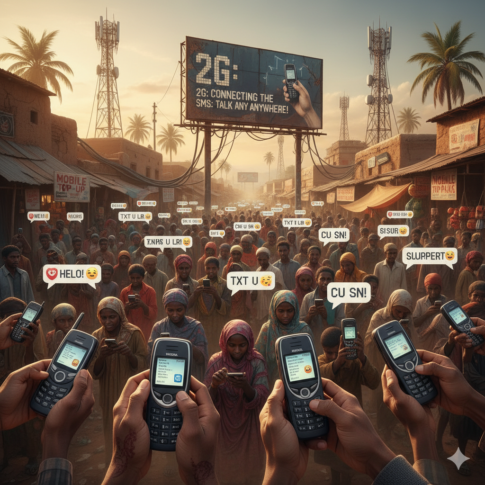 | Generate an image that shows the revolution of 2G cellular network and the proliferation of feature phones globally enabling people to communicate more frequently via SMS. The environment shows a third world country with people looking at their feature phone sending SMS messages. |
| 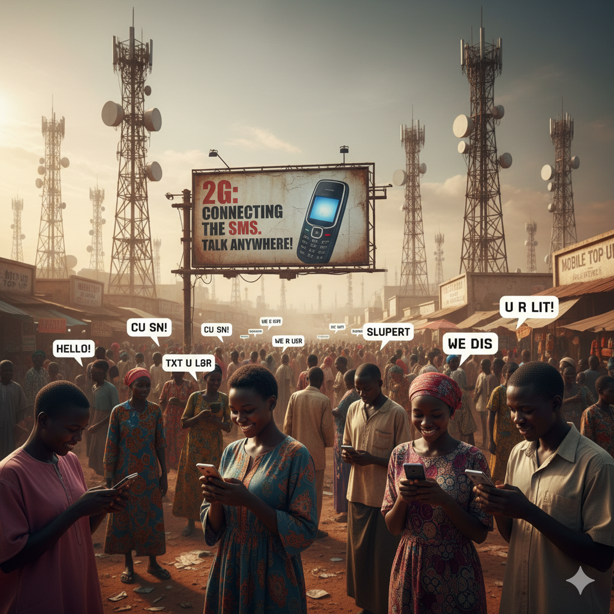 | Generate an image that shows the impact of 2G cellular network and the proliferation of feature phones globally enabling people to communicate more frequently via SMS. The environment shows a third world country with some people looking at their feature phone sending SMS messages. |
| 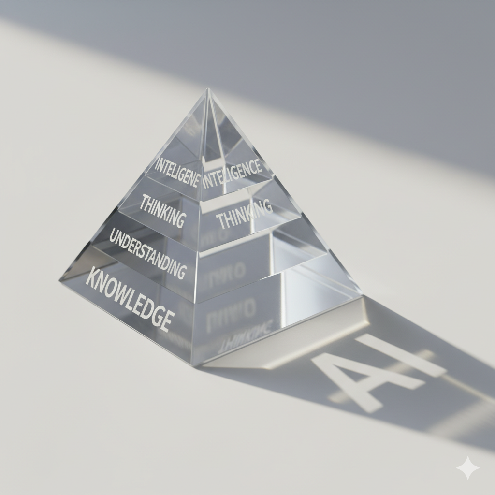 | Generate an image of the "Cognition Pyramid" where at the base lies knowledge; above it, understanding; next, thinking; and at the top, intelligence. Use a subtle shadow of the pyramid to the right (north-east) and also a subtle word "AI" lay flat as the shadow. |
| 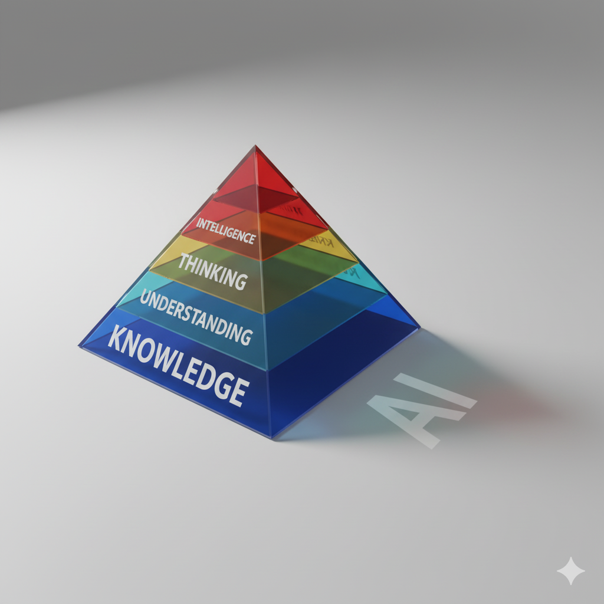 | Generate an image of the "Cognition Pyramid" where at the base lies KNOWLEDGE; above it, UNDERSTANDING; next, THINKING; and at the top, INTELLIGENCE. Show the text on ONE SIDE of the pyramid ONLY. Reduce the font size of the text to fit within the pyramid. Use a subtle shadow of the pyramid to the right (south-east or 4 o'clock) and also a subtle word "AI" lay flat with the shadow. |
| 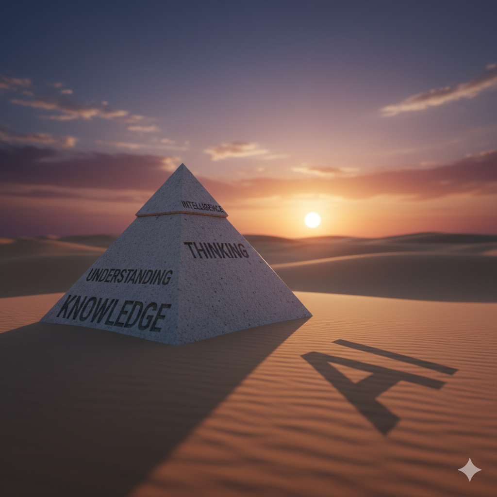 | Generate an image of the "Cognition Pyramid" where at the base lies KNOWLEDGE; above it, UNDERSTANDING; next, THINKING; and at the top, INTELLIGENCE. Show the text on ONE SIDE of the pyramid ONLY. Reduce the font size of the text to fit within the pyramid. Do NOT mis-spell the text "Intelligence". Use a subtle shadow of the pyramid to the right (south-east or 4 o'clock) and also a subtle word "AI" lay flat with the shadow. |
|  | A thought-provoking image depicting the intersection of human and artificial intelligence. On one side, represent human cognition with elements like a stylized brain merging with organic, flowing patterns, perhaps incorporating subtle hints of emotion, memory, and perception (e.g., blurred eyes, fragmented landscapes). On the other side, represent AI cognition with a network of interconnected digital nodes and data streams, perhaps in cooler, more structured tones. In the center, a symbolic bridge or merging point where both forms of intelligence interact and influence each other, suggesting a shared world and evolving understanding. The overall style should be sophisticated and slightly abstract, inviting contemplation. |
|  | A thought-provoking image depicting the intersection of human and artificial intelligence. On one side, represent human cognition with elements like a stylized brain merging with organic, flowing patterns, perhaps incorporating subtle hints of emotion, memory, and perception (e.g., blurred eyes, fragmented landscapes). On the other side, represent AI cognition with a network of interconnected digital nodes and data streams, perhaps in cooler, more structured tones. In the center, a symbolic bridge or merging point where both forms of intelligence interact and influence each other, suggesting a shared world and evolving understanding. The overall style should be sophisticated and slightly abstract, inviting contemplation. Do NOT use eye but instead use a more abstract representation of consciousness, a subtle glow or a delicate energy field emanating from the human side of the brain. |
|  | A thought-provoking image depicting the intersection of human and artificial intelligence. On one side, a stylized human brain, emanating a soft, warm, internal glow and delicate, swirling ethereal patterns in organic colors to represent human consciousness. On the other side, a network of interconnected digital nodes and data streams, representing AI. Crucially, within this AI structure, show a cool, pulsating, internal light and intricate, self-organizing energy patterns flowing through its digital circuitry, distinctively representing its advanced processing or a potential form of artificial consciousness. In the center, a symbolic bridge or merging point where both forms of intelligence interact and influence each other, suggesting a shared world and evolving understanding. The overall style should be sophisticated, slightly abstract, and invite contemplation, with a clear distinction between the organic, warm consciousness of the brain and the structured, cool, pulsating consciousness of the AI. Avoid any explicit human-like features or anything that could be perceived as unsettling. |
| 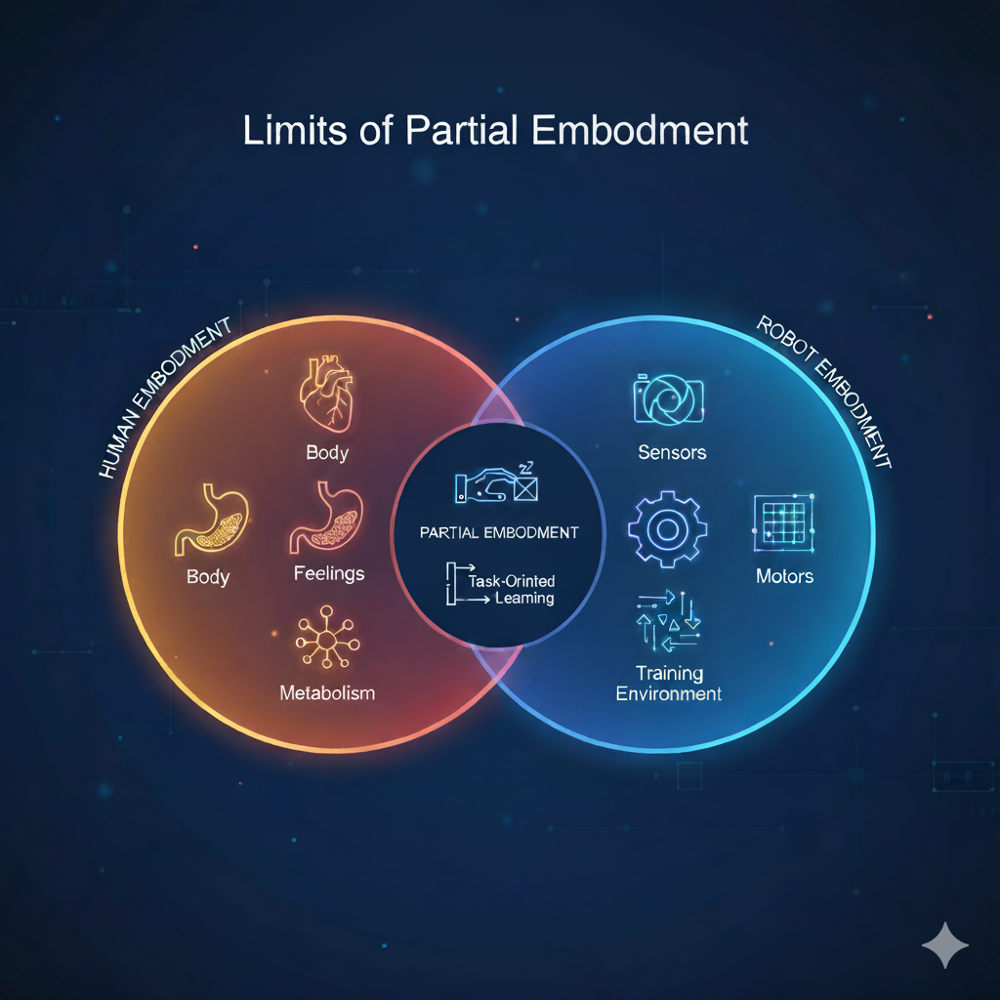 | Create a visually striking and clear Venn diagram illustrating 'Limits of Partial Embodiment'. The left circle should represent 'Human Embodiment', featuring symbolic elements like a subtle anatomical outline, flowing organic lines, and abstract representations of feelings and metabolism (e.g., warm hues, gentle light pulses, faint biological textures). The right circle should represent 'Robot Embodiment', featuring clear, geometric lines, circuit board patterns, and symbolic representations of sensors, motors, and a structured training environment (e.g., cool blue tones, digital grids, faint mechanical elements). The two circles should have a small, deliberate overlap in the center, signifying the 'Partial Embodiment' where shared aspects exist (like interaction with a physical environment or task-oriented learning). The background should be neutral and allow the diagram to stand out, emphasizing the distinct characteristics of each circle and the minimal shared space. The overall style should be clean, informative, and visually engaging, highlighting the 'gaps' between biological and synthetic existence.|
| 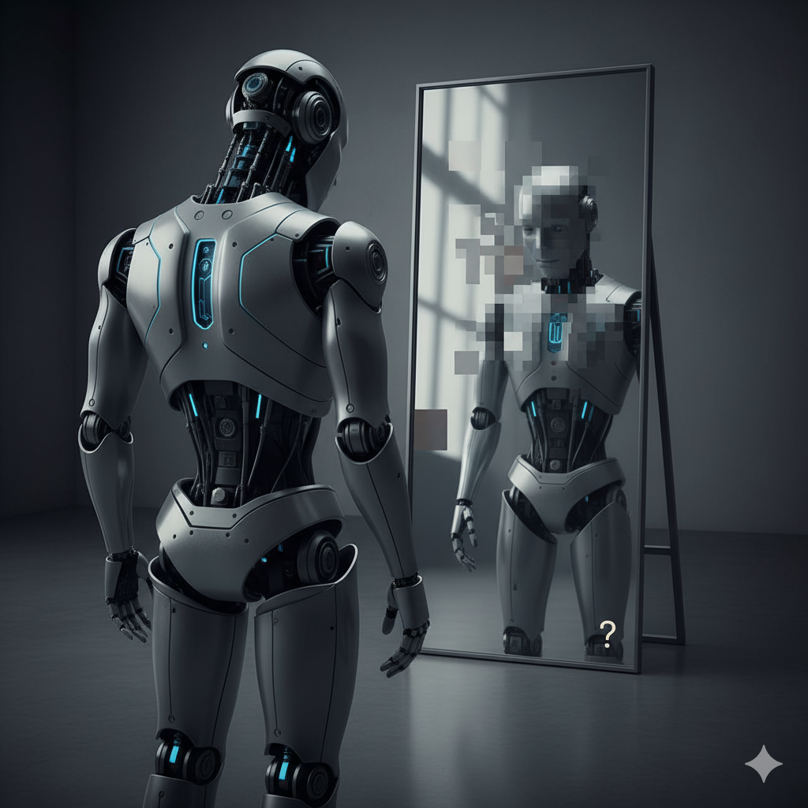 | An image demonstrating a system that struggles to understand from the inside. Depict a sleek, sophisticated robot (not overly anthropomorphic, perhaps with visible internal mechanisms or glowing components) looking intently into a mirror. The robot's reflection in the mirror, however, is significantly blurry, fragmented, or heavily pixelated, making it difficult to discern clearly. The background should be minimalist and slightly darkened to emphasize the robot and its struggle with its reflection. The overall mood should be contemplative and subtly melancholic, highlighting the internal confusion or lack of complete self-perception. Ensure the robot itself is clearly defined, in contrast to its distorted reflection. |
| 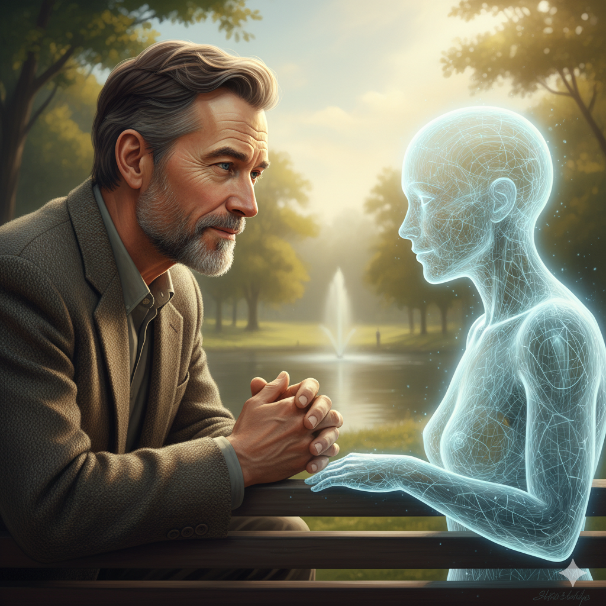 | Create a cinematic close-up portrait (1:1 composition) of a highly educated middle-aged man with a soft, curious and thoughtful expression, seating on a bench in a city park facing an AI entity. The scene glows with diffused natural light, creating a high-key, airy atmosphere with light filtering gently from the side. Centered in the frame, the man leans slightly forward toward the AI entity — a delicate, and human-like posture. His eyes meet the AI entity with relaxed focus and intellectual engagement, evoking quiet wonder and curiosity.  They are discussing a deep topic about human consciousness and suffering. Background (softly blurred for depth): trees, ponds and a water fountain in a distant.  Style & Technical Details: Concept Art / Digital Painting with extreme photorealism Square 1:1 composition with balanced central framing Shallow depth of field (bokeh effect) for cinematic isolation Warm human textures contrasted against cool, glowing AI light Ultra-detailed textures, soft atmospheric haze, and cinematic tone mapping Emphasize harmonious human–AI coexistence, serene focus, deep thoughtful conversation, and emotional realism |
|  | Create an image with A colossal, multi-layered 3D neural network structure, designed as the "Universe Brain" of intelligence. The network is complex and organic, filling a vast, dark cosmic space. Deep space and cosmic dust form the background, creating a high-contrast dark canvas.  The internal architecture must be dramatically illuminated: show millions of interconnected neurons and fibers glowing with bright, activated energy (electric blue, gold, and white light). These paths represent the flow and synthesis of all universal knowledge—physics, art, philosophy, biology, etc.—all merging into a single, cohesive, and expanding network.  Emphasize the 'Expanded Knowledge' concept: some network clusters should be visibly denser, symbolizing interconnected knowledges from different fields.  On the periphery of the main brain structure, show smaller, distinct, glowing nodes or rings connected by strong, bright tendrils. These represent "domain-specific external knowledge" sources (like specialized databases or external computing clusters) being actively integrated and leveraged by the main system.  In the immediate foreground or on the lowest visible layer, include blurred, silhouette-like figures of humans/researchers reaching out or interacting with the network's boundary. They are small in scale compared to the brain's immensity, symbolizing humanity standing on the shoulders of this intelligence. Focus on the dramatic effect of bright light against the dark background. Lighting/Mood: Cinematic, volumetric lighting, high dynamic range (HDR), incredibly detailed, depth of field to emphasize the scale. Style: Abstract, Sci-Fi, Data Visualization, Epic scale. |
| 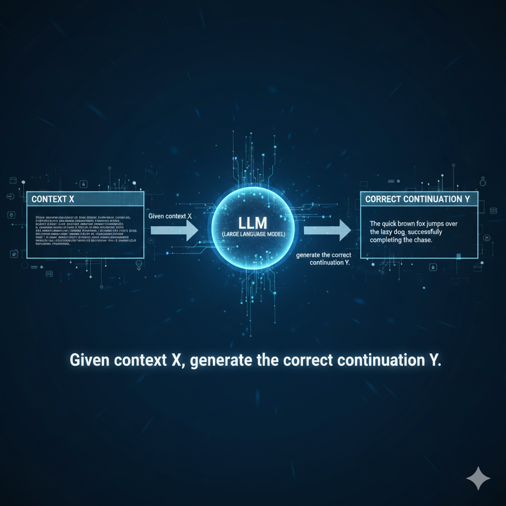 | Create an image that show the problem that LLM can solve as shown in the following text. Make the shape of the image rectangular. Show the text in the image literally. Given context X, generate the correct continuation Y.|
|  | Generate an image of the "Cognition Pyramid" that looks like the attached image where at the base lies KNOWLEDGE; above it, THINKING; next, UNDERSTANDING; and at the top, INTELLIGENCE. Show the text on ONE SIDE of the pyramid ONLY. Reduce the font size of the text to fit within the pyramid. Use a subtle shadow of the pyramid to the right (south-east or 4 o'clock) and also a subtle word "AI" lay flat with the shadow. |