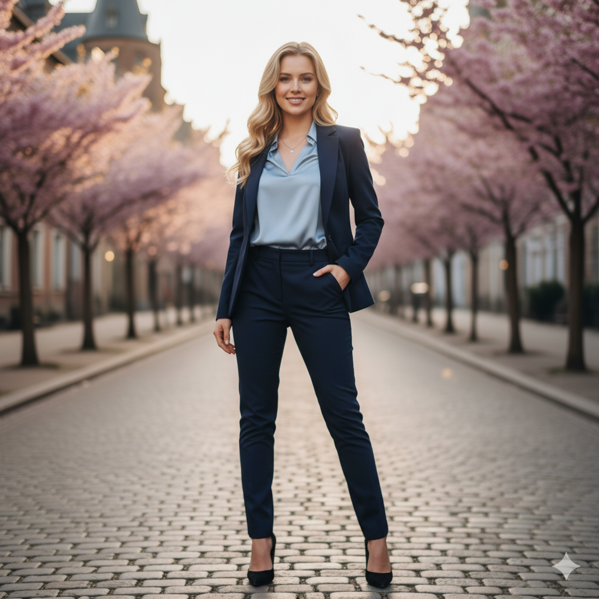

# PROMPTS

List of prompts that were used to generate the images.

| Filename | Prompt |
| --- | --- |
|  | a medium shot of a black female model. |
|  | a long shot of a caucasian blonde female model. |
|  | an extremely long shot of a asian male model.|
|  | Create a 3D isometric digital sculpture of a bronze sculpted relief of a ballerina, crafted with intricate detail and refined elegance. The ballerina is captured mid-dance, her posture graceful and balanced — one arm extended outward, the other raised gently upward, forming a fluid curve that expresses motion and poise.

Her skirt fans out dramatically in a circular motion, resembling flower petals or a swirling wave, with deeply carved folds and ripples that suggest movement and texture. The bodice is form-fitting, accentuating her slender frame and perfect ballet posture.

The background relief subtly recedes behind her, framing the dancer like a stage and creating depth and contrast within the sculpture.
The entire piece is made of bronze, featuring a rich dark patina with warm golden highlights where light strikes the raised surfaces.

Use soft, directional studio lighting to emphasize the metallic sheen and shadow depth.
Rendered as a realistic isometric digital sculpture, with museum-quality detail, cinematic lighting, and a sense of timeless beauty, elegance, and strength — a tribute to ballet frozen in motion.|
|  | A 3D isometric digital sculpture of a bronze ballerina, displayed as a free-standing figure in the center of a minimalist room.

The ballerina is mid-dance, graceful and balanced, with one arm extended outward and the other raised gently upward, forming a fluid, elegant curve that conveys motion and poise.
Her skirt flares outward like flower petals or a swirling wave, sculpted with deep folds and ripples that show movement and texture. The bodice is form-fitting, emphasizing her slender frame and perfect ballet posture.
The entire sculpture is bronze, with a dark patina and warm golden highlights on raised surfaces.

The background is a soft, warm-toned minimalist space in bronze or muted brown hues, keeping focus on the sculpture while maintaining tonal harmony.
Use soft, directional studio lighting to emphasize metallic reflections, subtle shadows, and depth.

Rendered in a realistic 3D digital art style with museum-quality detail, cinematic lighting, and a sense of timeless elegance, strength, and motion. |
|  | Create a 3D isometric digital sculpture of a bronze ballerina, displayed as a free-standing figure in the center of a minimalist room. The ballerina is sculpted in exquisite detail, captured mid-dance with a graceful and balanced posture — one arm extended outward, the other raised gently upward, forming a fluid, elegant curve that conveys motion and poise. Her skirt flows outward in a circular motion, like flower petals or a swirling wave, with deeply carved folds and ripples that create a sense of movement and lifelike texture. The bodice is form-fitting, highlighting her slender frame and perfect ballet posture. The sculpture is made of bronze, with a rich dark patina and warm golden highlights where light catches its surface. Place the figure in a softly lit 3D space with a warm, neutral background color similar to bronze tones, maintaining visual harmony with the sculpture. Use soft, directional studio lighting to accentuate the metallic sheen, subtle shadows, and contours of the dancer’s form. Rendered as a realistic isometric digital sculpture, with museum-quality detail, cinematic lighting, and a sense of timeless beauty and elegance — a tribute to ballet suspended in motion. |
|   | Make some adjustments to image you generated to be the same as the attached image focusing on the ballerina posture and her skirt. The ballerina is captured mid-dance, her posture graceful and poised. She extends one arm outward and the other gently upward, creating a fluid curve that emphasizes motion and balance. Her skirt fans out dramatically in a circular motion, resembling the petals of a flower or the swirl of a wave — the sculpting of the fabric is detailed, with deep folds and ripples that give it lifelike texture and movement. The bodice of her outfit is form-fitting, highlighting her slender frame and perfect posture. |
|   | The main object in the attached image is the ballerina. Remove the background and make the ballerina a 3D isometric digital sculpture of a bronze ballerina, displayed as a free-standing figure in the center of a minimalist room. |